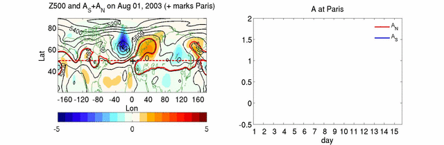

Matlab code for computing local wave activity (LWA) described in [Chen et al. 2015](../../../publication/2015-12-1-Chen2015).
* [tracer_eq_1var_2d_local3.m](./tracer_eq_1var_2d_local3.m): subroutine to compute local wave activity
* [test_tracer_eq_local.m](./test_tracer_eq_local.m): sample script to run the local wave activity code with idealized wave perturbations

A fortran 90 version of the code is also available by email contact.

Example of LWA for European summer heat waves in 2003:
